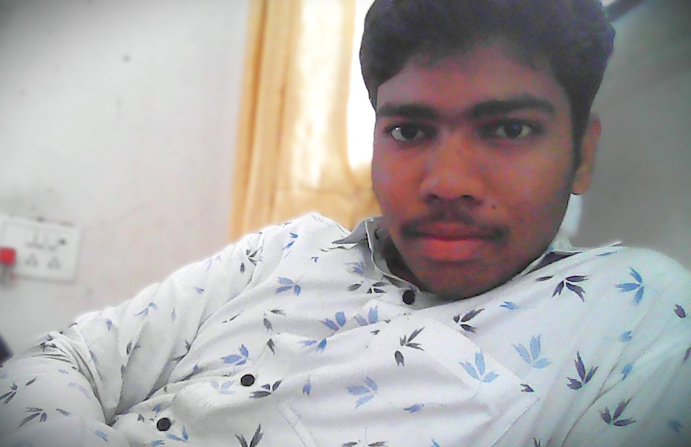

<html lang="en">
<head>
    <meta charset="UTF-8">
    <meta name="viewport" content="width=device-width, initial-scale=1.0">
    <title>Your Name - Portfolio</title>
</head>
<body>
    <!-- Navigation -->
    <nav>
        <ul>
            <li><a href="#home">Home</a></li>
            <li><a href="#about">About</a></li>
            <li><a href="#projects">Projects</a></li>
            <li><a href="#contact">Contact</a></li>
        </ul>
    </nav>

    <!-- Home Section -->
    <section id="home" class="home">
        <h1>Hi, I'm Ashish</h1>
        
A Commerce Student | Lawyer | Passionate

        <button><a href="tel:+17666544133"><b>Contact Me</b></a></button>
    </section>

    <section id="about" class="about">
        <h2><b>About Me</b></h2>
        
I’m Ashish, an aspiring lawyer passionate about justice and advocating for clients’ rights. Currently studying law at [University Name], I specialize in [specific areas of law]. My focus is on developing strong legal research, writing, and advocacy skills. I’m committed to using the law to create positive change and help those in need. I look forward to a career where I can make a meaningful impact in the legal field.

            ...

        
    </section>

    <!-- Projects Section -->
    <section id="projects" class="projects">
        <h2>My Projects</h2>
        

            <h3><b><u>Tic Tac Toe</u></b></h3>
            
Tic Tac Toe is a simple two-player game where players take turns marking spaces on a 3x3 grid with either an "X" or an "O." The goal is to be the first to align three of their marks horizontally, vertically, or diagonally....

            <a href="https://gaikwadrutuja1.github.io/Tic-Tac-Toe/" target="_blank"><i>click to Take a look of Interesting Game</i></a>
        

        

            <h3><b><u>Simple Meme generator</u></b></h3>
            
A meme generator is a tool that allows users to create custom memes by adding text to popular images or templates. It provides an easy and fun way to create and share humorous or relatable content...

            <a href="https://gaikwadrutuja1.github.io/meme/" target="_blank"><i>Click to Laugh by seeing meme</i></a>
        

        <!-- Add more projects here -->
    </section>

    <!-- Contact Section -->
    <section id="contact" class="contact">
        <h2>Contact Me</h2>
        <form action="rutujagaikwad062003@gmail.com" method="post" enctype="text/plain">
            <label for="name">Name:</label>
            <input type="text" id="name" name="name" required>
            <label for="email">Email:</label>
            <input type="email" id="email" name="email" required>
            <label for="message">Message:</label>
            <textarea id="message" name="message" required></textarea>
            <button type="submit">Send Message</button>
        </form>
       
    </section>
    

    <!-- Footer -->
    <footer>
        
&copy; 2025 Your Name. All Rights Reserved.

    </footer>

    
</body>
</html>
